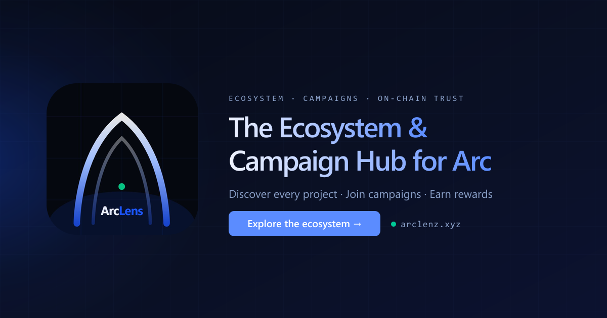

<div align="center">



# ArcLens

**The ecosystem, trust, and intelligence hub for [Arc](https://arc.network) — Circle's stablecoin Layer 1.**

[](https://arclenz.xyz)
[](https://nextjs.org)
[](https://www.typescriptlang.org)
[](https://supabase.com)
[](https://arc.network)
[](LICENSE)

[**Live → arclenz.xyz**](https://arclenz.xyz) · [**Ask Lens AI**](https://arclenz.xyz/lens) · [**Docs**](https://docs.arclenz.xyz)

</div>

---

ArcLens is where the Arc ecosystem lives: discover every project, read verified on-chain data, follow the builders shaping the chain, track events, and ask **Lens AI** anything about it.

## Lens AI


Lens is ArcLens's intelligence layer — and the first AI that **pays the builders it learns from**.

Ask it anything about Arc and it answers from live on-chain data, then routes a small USDC payment, on-chain, to the teams whose work grounded the answer. Every payout is public and verifiable. It's not about the amount; it's recognition, made real, for the people showing up to build on Arc.

This is what an agentic economy should look like: agents that credit the people they're built on.

<br clear="right" />

## What's inside

- **Lens AI** — live, grounded answers about Arc, projects, builders, metrics, and events; pays the builders it cites, on-chain.
- **Trust layer** — an on-chain badge ladder (Listed → Claimed → Verified, plus Established, Arc Partner / Official) so anyone can tell proven projects from unproven ones.
- **Metrics** — TVL, volume, and revenue tracking with pluggable methods; on-chain-verified figures rank the leaderboard, protocol-reported figures are clearly labeled.
- **Ecosystem directory** — every project on Arc, categorized, searchable, with live stats and builder profiles.
- **Arc Trials** — trial campaigns that connect builders with verified testers, settled in USDC.
- **Events** — official Arc House events alongside community submissions, with correct local times and one-click calendar add.

## Architecture

```
Browser ─┬─ Next.js App Router (RSC + client) ──────────────┐
         │                                                   │
         │   /api/ai/chat ── Lens AI (Gemini + RAG + tools) ─┤
         │   /api/ecosystem, /api/trials, /api/tvl … ────────┤
         │                                                   ▼
         │                                          PostgreSQL (Supabase)
         │                                                   ▲
Arc RPC ─┴─ on-chain indexer (cron) ── TVL / volume / revenue┘
             • eth_getLogs with range bisection
             • rate-limit retry + concurrency gating
             • 6-confirmation reorg buffer
             • subgraph fallback for large multi-pool DEXes

Circle / Arc: Developer-Controlled Wallets · Gateway (x402) ·
ERC-8004 agent identity · USDC & EURC settlement on Arc
```

- **Reads** (directory, metrics, events) are CDN-cached route handlers over Postgres.
- **The indexer** runs on scheduled crons, reconciling reported figures against on-chain state down to the transaction hash.
- **Lens AI** builds context (role, page, retrieved knowledge, prior chats), calls live-data tools, streams the answer, then settles builder recognition on-chain.

## Stack

| Layer | Tech |
|---|---|
| **App** | Next.js 16 (App Router), TypeScript, React |
| **Data** | PostgreSQL (Supabase), a resilient on-chain indexer with rate-limit and drift handling |
| **AI** | Vercel AI SDK, Gemini, retrieval over a curated Arc knowledge base |
| **Circle + Arc** | Developer-Controlled Wallets, Gateway (x402), ERC-8004 agent identity, USDC & EURC on Arc |
| **Infra** | Vercel |

## Local development

```bash
npm install
npm run dev   # http://localhost:3000
```

### Configuration

Create a `.env.local` with the variables below. The app boots with the **core** group; the rest unlock specific features.

| Variable | Group | Purpose |
|---|---|---|
| `DATABASE_URL` | Core | PostgreSQL connection string (Supabase) |
| `ARC_RPC_URL` | Core | Arc RPC endpoint for the indexer & explorer |
| `SESSION_SECRET` | Core | Signs wallet-session cookies |
| `ADMIN_PASSWORD` | Core | Admin panel access |
| `NEXT_PUBLIC_BASE_URL` | Core | Canonical site URL (links, emails) |
| `GEMINI_API_KEY` | Lens AI | Gemini key (or `GOOGLE_GENERATIVE_AI_API_KEY`). **Use a paid tier** — free-tier inputs may be used for training |
| `AI_RETENTION_DAYS` | Lens AI | Chat retention window (default `30`) |
| `LENS_AI_DAILY_GLOBAL` | Lens AI | Hard daily cap on total model calls |
| `CIRCLE_API_KEY`, `CIRCLE_ENTITY_SECRET` | Circle | Developer-Controlled Wallets |
| `USDC_ARC_ADDRESS`, `ARCLENS_REGISTRY` | Arc | On-chain token & trust registry |
| `LENS_WALLET_ID`, `PAYOUT_WALLET_PRIVATE_KEY` | Payments | Builder-recognition payouts (`LENS_PAY_*` knobs tune amount/caps) |
| `RESEND_API_KEY` | Email | Transactional email (approvals, campaigns) |
| `BLOB_READ_WRITE_TOKEN` | Uploads | Vercel Blob for logos/images |
| `VIRUSTOTAL_API_KEY` | Trust | URL reputation scanning |
| `CRON_SECRET` | Ops | Authorizes scheduled indexer/metrics jobs |

> Full list and advanced tuning (`LENS_PAY_*`, `LENS_ASK_*`) are documented in the [docs](https://docs.arclenz.xyz).

## License

Released under the [MIT License](LICENSE). © 2026 ArcLens.

## Links

- **Live:** https://arclenz.xyz
- **Lens AI:** https://arclenz.xyz/lens
- **Docs:** https://docs.arclenz.xyz
- **Arc:** https://arc.network
